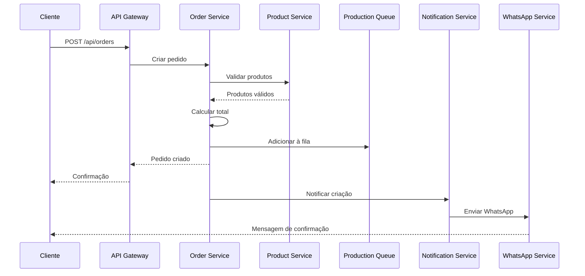
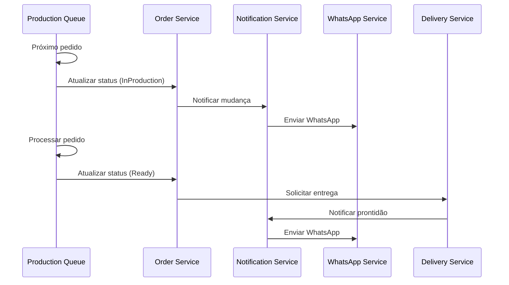
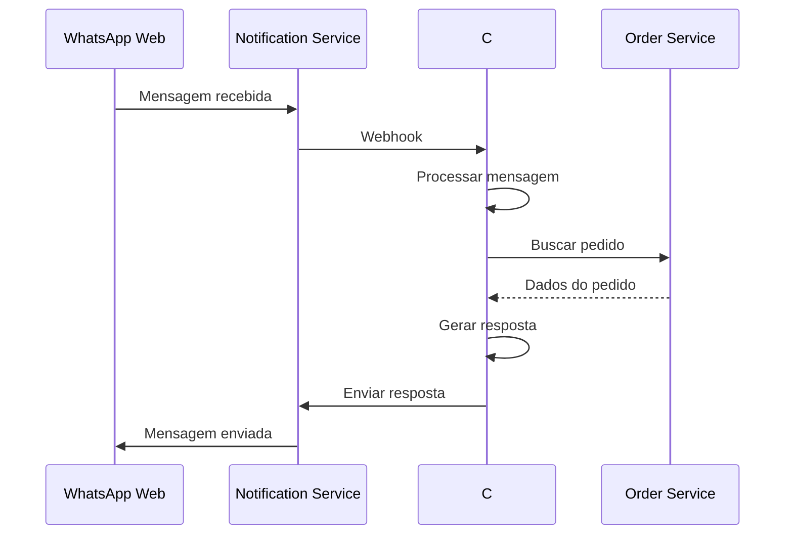

# 🏗️ Arquitetura do Sistema - Lach Snack Bar

## 📋 Índice

1. [Visão Geral](#visão-geral)
2. [Arquitetura de Microserviços](#arquitetura-de-microserviços)
3. [Componentes do Sistema](#componentes-do-sistema)
4. [Fluxo de Dados](#fluxo-de-dados)
5. [Tecnologias Utilizadas](#tecnologias-utilizadas)
6. [Padrões de Design](#padrões-de-design)
7. [Segurança](#segurança)
8. [Escalabilidade](#escalabilidade)
9. [Monitoramento](#monitoramento)

## 🌟 Visão Geral

O Lach Snack Bar é um sistema de gerenciamento de pedidos baseado em microserviços, projetado para oferecer alta disponibilidade, escalabilidade e flexibilidade. A arquitetura segue os princípios de Domain-Driven Design (DDD) e utiliza tecnologias modernas para garantir performance e manutenibilidade.

### Objetivos da Arquitetura

- **Alta Disponibilidade:** 99.9% uptime
- **Escalabilidade:** Suporte a 1000+ pedidos simultâneos
- **Performance:** Tempo de resposta < 200ms
- **Manutenibilidade:** Código limpo e bem documentado
- **Segurança:** Proteção de dados e autenticação robusta

## 🏢 Arquitetura de Microserviços

### Diagrama da Arquitetura

```
┌─────────────────────────────────────────────────────────────────┐
│                        API Gateway                              │
│                    (Ocelot + YARP)                             │
└─────────────────────┬───────────────────────────────────────────┘
                      │
    ┌─────────────────┼─────────────────┐
    │                 │                 │
┌───▼────┐    ┌──────▼──────┐    ┌─────▼────┐
│ Auth   │    │ Product    │    │ Order    │
│Service │    │ Service    │    │ Service  │
└────────┘    └────────────┘    └──────────┘
    │                 │                 │
    └─────────────────┼─────────────────┘
                      │
    ┌─────────────────┼─────────────────┐
    │                 │                 │
┌───▼────┐    ┌──────▼──────┐    ┌─────▼────┐
│Production│   │ Delivery   │    │WhatsApp  │
│ Queue   │   │ Service    │    │ Service  │
└────────┘    └────────────┘    └──────────┘
    │                 │                 │
    └─────────────────┼─────────────────┘
                      │
              ┌───────▼──────┐
              │ Notification │
              │ Service      │
              └──────────────┘
```

### Comunicação entre Serviços

#### 1. Síncrona (HTTP/REST)
- **API Gateway ↔ Serviços:** Comunicação direta via HTTP
- **Serviços ↔ Serviços:** Chamadas REST para operações críticas

#### 2. Assíncrona (RabbitMQ)
- **Eventos de Domínio:** Notificações de mudanças de estado
- **Comandos:** Instruções para execução de tarefas
- **Integração:** Comunicação com sistemas externos

## 🔧 Componentes do Sistema

### 1. API Gateway
**Tecnologia:** Ocelot + YARP
**Porta:** 8080
**Responsabilidades:**
- Roteamento de requisições
- Autenticação e autorização
- Rate limiting
- Logging centralizado
- CORS
- Load balancing

**Configuração:**
```json
{
  "Routes": [
    {
      "DownstreamPathTemplate": "/api/auth/{everything}",
      "DownstreamScheme": "http",
      "DownstreamHostAndPorts": [
        {
          "Host": "auth-service",
          "Port": 5001
        }
      ],
      "UpstreamPathTemplate": "/api/auth/{everything}",
      "UpstreamHttpMethod": [ "GET", "POST", "PUT", "DELETE" ]
    }
  ]
}
```

### 2. Auth Service
**Tecnologia:** ASP.NET Core 8
**Porta:** 5001
**Database:** PostgreSQL
**Responsabilidades:**
- Autenticação de usuários
- Gerenciamento de JWT
- Autorização baseada em roles
- Refresh tokens
- Auditoria de login

**Entidades:**
```csharp
public class UserEntity
{
    public Guid Id { get; set; }
    public string Username { get; set; }
    public string Email { get; set; }
    public string PasswordHash { get; set; }
    public UserRole Role { get; set; }
    public bool IsActive { get; set; }
    public DateTime CreatedAt { get; set; }
    public DateTime? LastLoginAt { get; set; }
}
```

### 3. Product Service
**Tecnologia:** ASP.NET Core 8
**Porta:** 5002
**Database:** PostgreSQL
**Responsabilidades:**
- Gerenciamento de produtos
- Categorização
- Controle de estoque
- Gerenciamento de adicionais
- Preços e promoções

**Entidades:**
```csharp
public class ProductEntity
{
    public Guid Id { get; set; }
    public string Name { get; set; }
    public string Description { get; set; }
    public decimal Price { get; set; }
    public string Category { get; set; }
    public bool IsAvailable { get; set; }
    public bool HasAddOns { get; set; }
    public List<ProductAddOnEntity> AddOns { get; set; }
}

public class ProductAddOnEntity
{
    public Guid Id { get; set; }
    public string Name { get; set; }
    public decimal Price { get; set; }
    public string Category { get; set; }
    public int MaxQuantity { get; set; }
    public Guid ProductId { get; set; }
}
```

### 4. Order Service
**Tecnologia:** ASP.NET Core 8
**Porta:** 5003
**Database:** PostgreSQL
**Responsabilidades:**
- Criação de pedidos
- Gerenciamento de status
- Cálculo de preços
- Histórico de pedidos
- Integração com pagamento

**Estados do Pedido:**
```csharp
public enum OrderStatus
{
    Pending,        // Pendente
    Confirmed,      // Confirmado
    InProduction,   // Em Produção
    Ready,          // Pronto
    OutForDelivery, // Saiu para Entrega
    Delivered,      // Entregue
    Cancelled       // Cancelado
}
```

### 5. Production Queue Service
**Tecnologia:** ASP.NET Core 8
**Porta:** 5004
**Database:** PostgreSQL
**Responsabilidades:**
- Fila de produção
- Priorização de pedidos
- Tempo estimado de preparo
- Notificações de status
- Otimização de recursos

### 6. Delivery Service
**Tecnologia:** ASP.NET Core 8
**Porta:** 5005
**Database:** PostgreSQL
**Responsabilidades:**
- Gerenciamento de entregas
- Rastreamento de pedidos
- Atribuição de entregadores
- Cálculo de rotas
- Confirmação de entrega

### 7. WhatsApp Service
**Tecnologia:** ASP.NET Core 8 + Node.js
**Porta:** 5006 (C#) + 3001 (Node.js)
**Database:** SQLite (Node.js) + PostgreSQL (C#)
**Responsabilidades:**
- Integração com WhatsApp
- Chatbot automático
- Notificações de status
- Gerenciamento de sessões
- Histórico de mensagens

### 8. Notification Service
**Tecnologia:** ASP.NET Core 8
**Porta:** 5007
**Database:** PostgreSQL
**Responsabilidades:**
- Envio de notificações
- Múltiplos canais (email, SMS, push)
- Templates de mensagem
- Agendamento de notificações
- Relatórios de entrega

## 🔄 Fluxo de Dados

### 1. Criação de Pedido



### 2. Processamento de Pedido



### 3. Integração WhatsApp



## 🛠️ Tecnologias Utilizadas

### Backend
- **.NET 8:** Framework principal
- **ASP.NET Core:** Web framework
- **Entity Framework Core:** ORM
- **PostgreSQL:** Banco de dados principal
- **SQLite:** Banco local (WhatsApp)
- **RabbitMQ:** Message broker
- **Redis:** Cache (opcional)

### Frontend (Futuro)
- **React:** Framework frontend
- **Material-UI:** Componentes
- **TypeScript:** Tipagem estática
- **Redux Toolkit:** Gerenciamento de estado

### DevOps
- **Docker:** Containerização
- **Docker Compose:** Orquestração local
- **GitHub Actions:** CI/CD
- **Prometheus:** Métricas
- **Grafana:** Dashboards
- **Serilog:** Logging

### Integração
- **whatsapp-web.js:** Integração WhatsApp
- **Puppeteer:** Automação browser
- **Express.js:** Servidor Node.js

## 🎨 Padrões de Design

### 1. Domain-Driven Design (DDD)

**Bounded Contexts:**
- **Auth Context:** Usuários e autenticação
- **Product Context:** Produtos e menu
- **Order Context:** Pedidos e pagamentos
- **Production Context:** Fila de produção
- **Delivery Context:** Entregas e logística
- **Communication Context:** Notificações e WhatsApp

**Aggregates:**
```csharp
// Order Aggregate
public class Order : AggregateRoot
{
    public OrderId Id { get; private set; }
    public CustomerId CustomerId { get; private set; }
    public List<OrderItem> Items { get; private set; }
    public OrderStatus Status { get; private set; }
    
    public void AddItem(ProductId productId, int quantity)
    {
        // Business logic
        AddDomainEvent(new OrderItemAddedEvent(Id, productId, quantity));
    }
    
    public void Confirm()
    {
        // Business logic
        Status = OrderStatus.Confirmed;
        AddDomainEvent(new OrderConfirmedEvent(Id));
    }
}
```

### 2. CQRS (Command Query Responsibility Segregation)

```csharp
// Commands
public class CreateOrderCommand : IRequest<OrderId>
{
    public CustomerId CustomerId { get; set; }
    public List<OrderItemDto> Items { get; set; }
}

// Queries
public class GetOrderQuery : IRequest<OrderDto>
{
    public OrderId OrderId { get; set; }
}

// Handlers
public class CreateOrderCommandHandler : IRequestHandler<CreateOrderCommand, OrderId>
{
    public async Task<OrderId> Handle(CreateOrderCommand request, CancellationToken cancellationToken)
    {
        // Implementation
    }
}
```

### 3. Event Sourcing

```csharp
public class OrderEventStore
{
    public async Task SaveEvents(OrderId orderId, IEnumerable<IDomainEvent> events, int expectedVersion)
    {
        // Save events to event store
    }
    
    public async Task<IEnumerable<IDomainEvent>> GetEvents(OrderId orderId)
    {
        // Retrieve events from event store
    }
}
```

### 4. Repository Pattern

```csharp
public interface IOrderRepository
{
    Task<Order> GetByIdAsync(OrderId id);
    Task<IEnumerable<Order>> GetByCustomerAsync(CustomerId customerId);
    Task SaveAsync(Order order);
    Task DeleteAsync(OrderId id);
}
```

## 🔒 Segurança

### 1. Autenticação

- **JWT Tokens:** Autenticação stateless
- **Refresh Tokens:** Renovação automática
- **Password Hashing:** BCrypt
- **Rate Limiting:** Proteção contra ataques

### 2. Autorização

```csharp
[Authorize(Roles = "Admin,Staff")]
public class OrderController : ControllerBase
{
    [Authorize(Roles = "Admin")]
    public async Task<IActionResult> CancelOrder(OrderId id)
    {
        // Only admins can cancel orders
    }
}
```

### 3. Validação de Dados

```csharp
public class CreateOrderRequest
{
    [Required]
    public Guid CustomerId { get; set; }
    
    [Required]
    [MinLength(1)]
    public List<OrderItemRequest> Items { get; set; }
    
    [Required]
    public DeliveryAddressRequest DeliveryAddress { get; set; }
}
```

### 4. Criptografia

- **HTTPS:** Comunicação segura
- **Data Encryption:** Dados sensíveis criptografados
- **API Keys:** Chaves seguras para integrações

## 📈 Escalabilidade

### 1. Horizontal Scaling

```yaml
# docker-compose.production.yml
services:
  order-service:
    image: lach/order-service:latest
    deploy:
      replicas: 3
      resources:
        limits:
          memory: 512M
          cpus: '0.5'
    environment:
      - ASPNETCORE_ENVIRONMENT=Production
```

### 2. Load Balancing

```nginx
upstream api_gateway {
    server api-gateway-1:5000;
    server api-gateway-2:5000;
    server api-gateway-3:5000;
}
```

### 3. Caching

```csharp
[Cache(Duration = 300)] // 5 minutes
public async Task<ProductDto> GetProductAsync(Guid id)
{
    return await _productService.GetByIdAsync(id);
}
```

### 4. Database Sharding

```csharp
// Future implementation
public class ShardedOrderRepository : IOrderRepository
{
    public async Task<Order> GetByIdAsync(OrderId id)
    {
        var shard = _shardSelector.GetShard(id);
        return await shard.GetOrderAsync(id);
    }
}
```

## 📊 Monitoramento

### 1. Métricas

```csharp
public class OrderMetrics
{
    private readonly Counter _ordersCreated;
    private readonly Histogram _orderProcessingTime;
    
    public OrderMetrics(IMetricsFactory metricsFactory)
    {
        _ordersCreated = metricsFactory.CreateCounter("orders_created_total", "Total orders created");
        _orderProcessingTime = metricsFactory.CreateHistogram("order_processing_seconds", "Order processing time");
    }
}
```

### 2. Health Checks

```csharp
public class OrderHealthCheck : IHealthCheck
{
    public async Task<HealthCheckResult> CheckHealthAsync(HealthCheckContext context, CancellationToken cancellationToken = default)
    {
        try
        {
            // Check database connection
            // Check RabbitMQ connection
            return HealthCheckResult.Healthy();
        }
        catch (Exception ex)
        {
            return HealthCheckResult.Unhealthy(ex.Message);
        }
    }
}
```

### 3. Logging

```csharp
public class OrderController : ControllerBase
{
    private readonly ILogger<OrderController> _logger;
    
    [HttpPost]
    public async Task<IActionResult> CreateOrder(CreateOrderRequest request)
    {
        _logger.LogInformation("Creating order for customer {CustomerId}", request.CustomerId);
        
        try
        {
            var order = await _orderService.CreateAsync(request);
            _logger.LogInformation("Order {OrderId} created successfully", order.Id);
            return Ok(order);
        }
        catch (Exception ex)
        {
            _logger.LogError(ex, "Failed to create order for customer {CustomerId}", request.CustomerId);
            throw;
        }
    }
}
```

### 4. Distributed Tracing

```csharp
public class OrderService
{
    public async Task<Order> CreateAsync(CreateOrderRequest request)
    {
        using var activity = _activitySource.StartActivity("CreateOrder");
        activity?.SetTag("customer.id", request.CustomerId.ToString());
        
        // Implementation
    }
}
```

## 🚀 Próximos Passos

### Melhorias Planejadas

1. **Kubernetes Deployment:** Orquestração em produção
2. **Service Mesh:** Istio para comunicação entre serviços
3. **Event Sourcing:** Histórico completo de mudanças
4. **GraphQL:** API mais flexível
5. **Machine Learning:** Recomendações de produtos
6. **Real-time Updates:** WebSockets para atualizações em tempo real

### Roadmap

- **Q1 2024:** Frontend React
- **Q2 2024:** Kubernetes deployment
- **Q3 2024:** Machine learning features
- **Q4 2024:** Mobile app

## 📚 Recursos Adicionais

- [Documentação da API](../docs/API_DOCUMENTATION.md)
- [Guia de Deployment](../docs/DEPLOYMENT_GUIDE.md)
- [Guia de Desenvolvimento](../docs/DEVELOPMENT_GUIDE.md)
- [Integração WhatsApp](../WHATSAPP_INTEGRATION.md) 